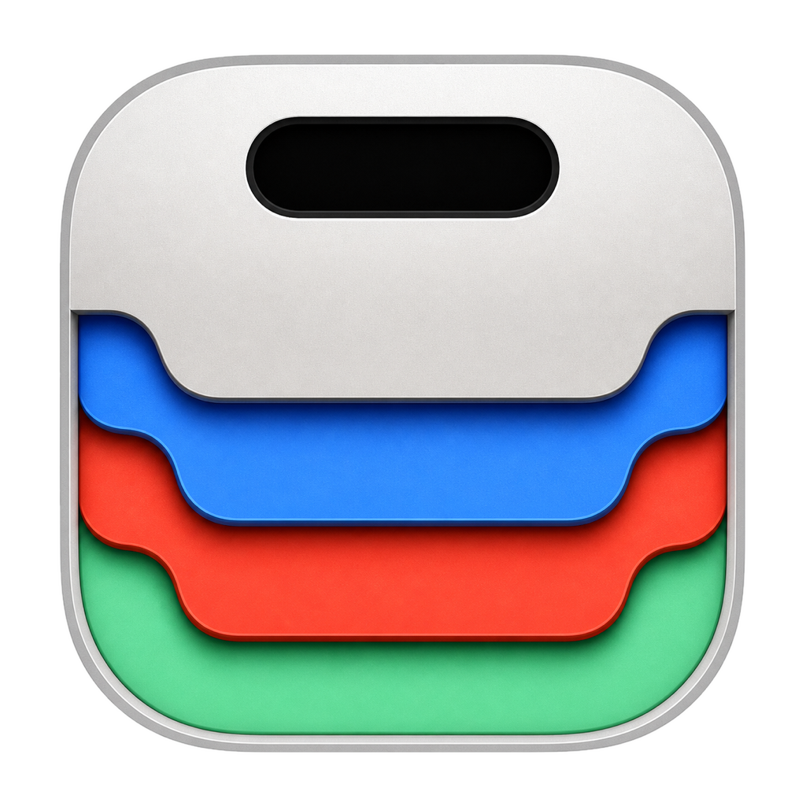

中文 | [English](README.md)

<p align="center">
  
</p>

<h1 align="center">X Nook</h1>

<p align="center">
  一款 macOS 灵动岛风格的工具中心。<br>
  X Island 的配套应用 — 媒体、日历、笔记、文件架尽在指尖。
</p>

## 演示

<p align="center">
  
</p>

| 收起状态 | 展开状态 | 切换到 X Island |
|:-------:|:-------:|:--------------:|
|  |  |  |

## 功能介绍

X Nook 以紧凑的药丸形状悬浮在屏幕顶部。鼠标悬停即可展开，访问你的工具。

**核心功能：**

- **媒体播放** — 控制音乐播放，显示专辑封面
- **日历 Widget** — 一目了然查看即将到来的日程
- **笔记 Widget** — 快速记笔记，支持 Markdown
- **文件架** — 拖放文件，快速访问
- **应用切换** — 双指滑动在 X Nook 和 X Island 之间切换
- **多显示器** — 自动跟随鼠标在屏幕间切换
- **刘海适配** — 专为 MacBook 刘海屏设计
- **触控板手势** — 双指下滑展开面板（可配置）
- **果冻动画** — 鼠标进入药丸时的弹性动效，强度可调（弱/中/强）
- **磁吸效果** — 药丸在鼠标靠近时水平吸附偏移
- **透明光标** — 悬停药丸时隐藏系统光标，离开恢复
- **偏好设置** — 在设置窗口自定义行为（⌘,）

**即将推出：**

- 快捷指令集成
- 摄像头镜像 Widget
- 蓝牙设备显示
- 流体渐变动画

## 系统要求

- macOS 14.0 或更高版本
- Xcode 15.0 或更高版本

## 安装

### 方式一：构建应用包

```bash
chmod +x build-app.sh
./build-app.sh
open ".build/X Nook.app"
```

推荐使用此方式在本地运行 X Nook，因为生成的应用包会包含
`Info.plist` 中必需的隐私权限说明。

### 方式二：开发构建

可在 Xcode 中打开 `Package.swift` 浏览代码，或仅执行编译检查：

```bash
swift build
```

## 项目结构

```
XNook/
├── App/
│   ├── XNookApp.swift              # 入口
│   └── AppDelegate.swift           # 应用委托
├── Core/
│   ├── NotchWindow.swift           # 自定义窗口管理
│   ├── NotchDetector.swift         # 刘海检测
│   ├── AppSwitcher.swift           # 应用切换
│   ├── IslandSizeCalculator.swift  # 岛屿尺寸计算
│   ├── IslandStyle.swift           # 岛屿样式
│   ├── NotchShapeGeometry.swift    # 刘海形状几何
│   └── SingleInstanceLock.swift    # 单实例锁
├── Features/
│   ├── NotchContentView.swift      # 主界面
│   ├── MediaWidget/                # 媒体播放
│   ├── CalendarWidget/             # 日历集成
│   ├── NotesWidget/                # 笔记编辑器
│   └── TrayWidget/                 # 文件架
├── Localization/
│   └── L10n.swift                  # 多语言
└── Settings/
    └── SettingsView.swift          # 偏好设置
```

## 相关项目

- [X Island](https://github.com/Meteorkid/XIsland) — AI 编程助手监控器
- [NotchNook](https://lo.cafe/notchnook) — 原版 Notch 工具中心（闭源）

## 许可证

MIT 许可证

## 贡献

欢迎贡献！请随时提交 Pull Request。
